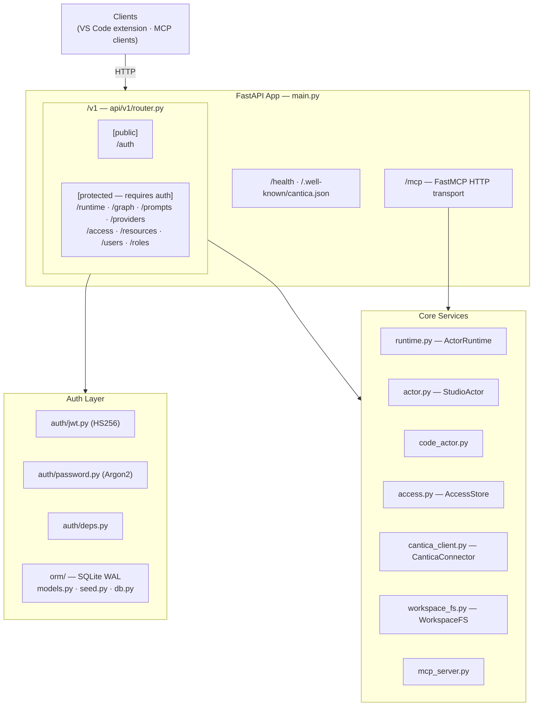
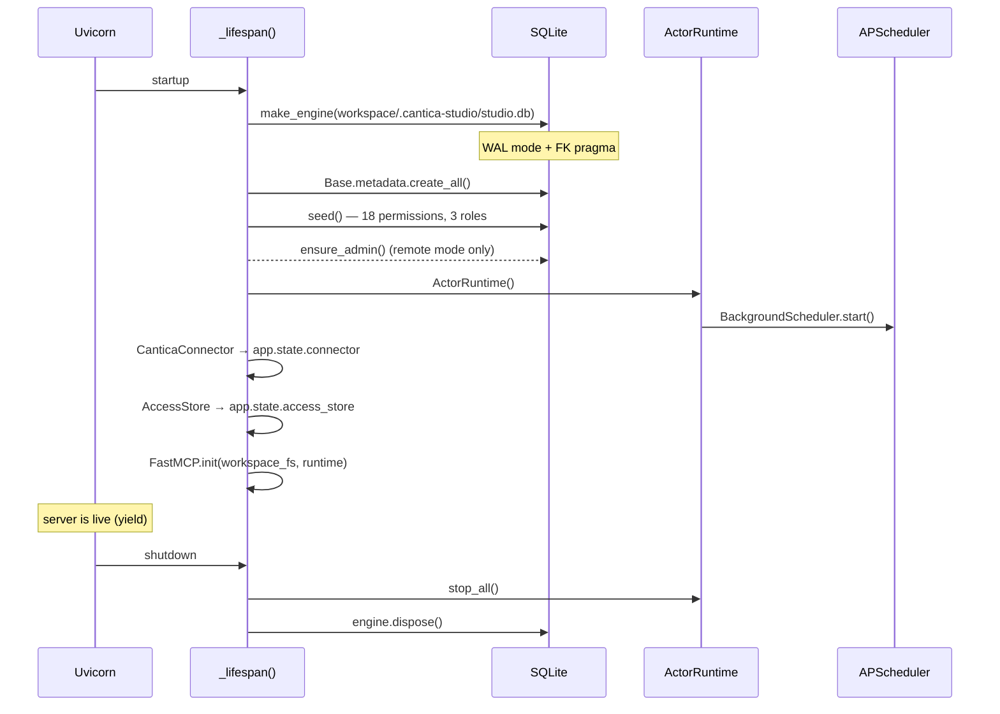
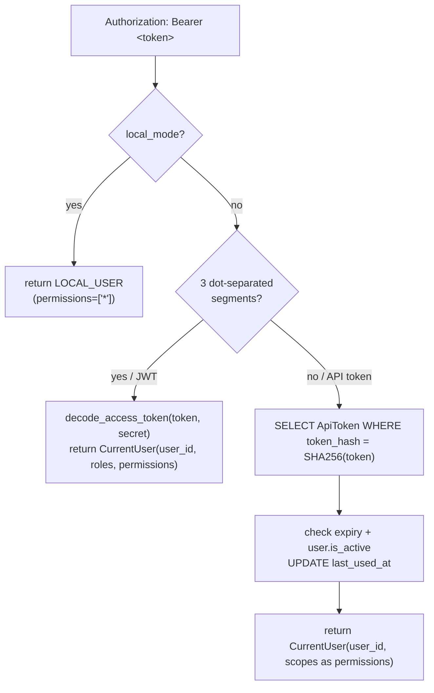
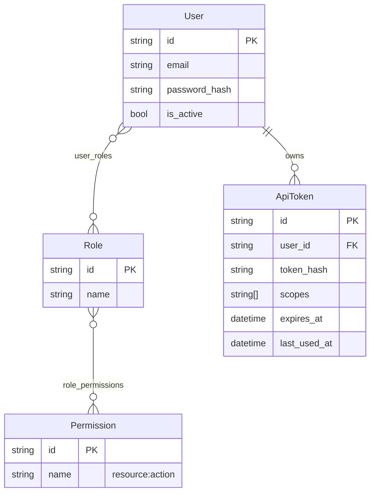
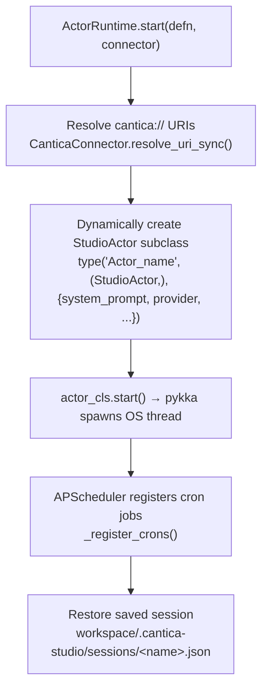
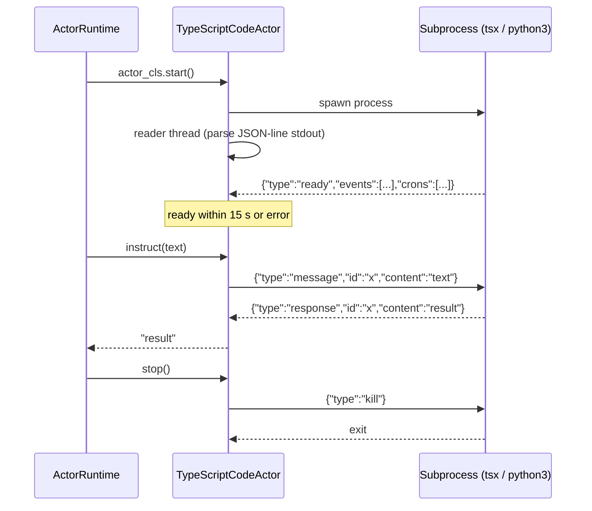
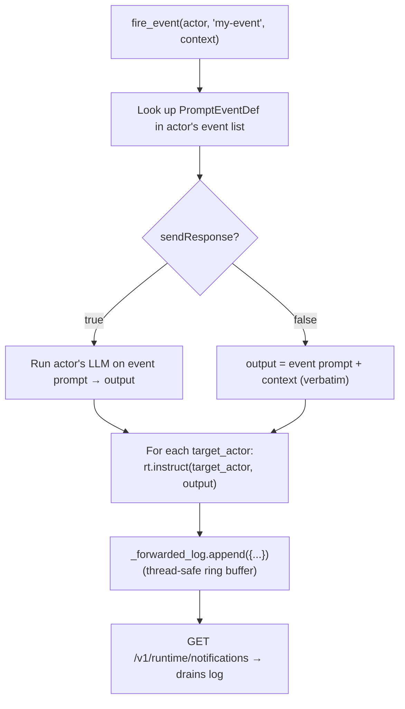
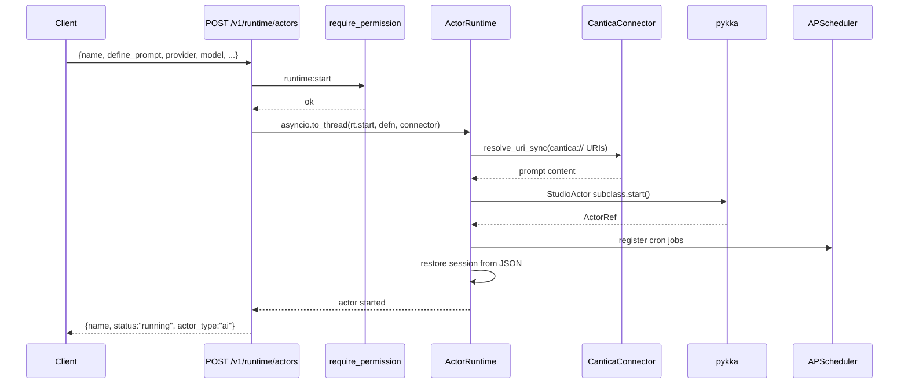
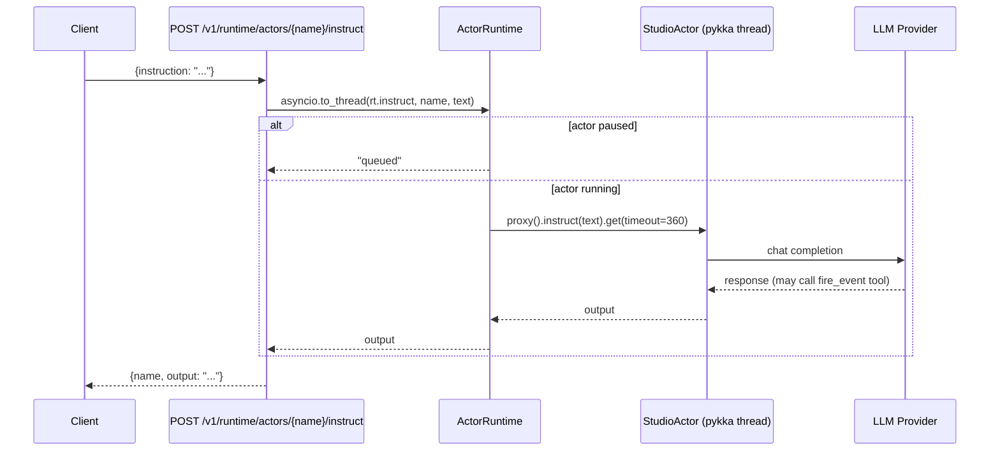
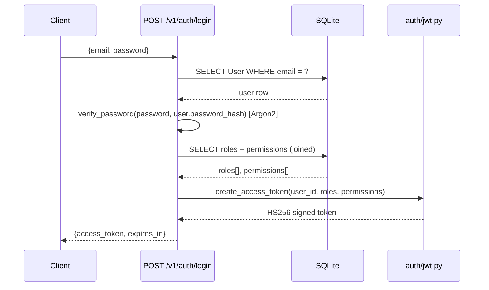

# Studio API — Architecture

## Overview

The Studio API is a FastAPI server that manages AI and code actors for the Cantica Studio VS Code extension. It supports two modes:

- **local mode** (`STUDIO_LOCAL_MODE=true`, default): auth is bypassed; a single pseudo-user with all permissions is granted to every request. API keys are read from host env vars.
- **remote mode**: full JWT + RBAC auth; an admin user is seeded on first start.

---

## Layer Diagram



---

## File Layout

```
src/studio_api/
├── main.py              entry point, lifespan, app factory
├── config.py            Settings (pydantic-settings, STUDIO_ prefix)
├── runtime.py           ActorRuntime — actor lifecycle, scheduling, notifications
├── actor.py             StudioActor — pykka AI actor with events, crons, tools
├── code_actor.py        TypeScriptCodeActor — subprocess actor (JSON-line protocol)
├── access.py            AccessStore — provider credential records
├── cantica_client.py    CanticaConnector — fetches prompts from Cantica servers
├── workspace_fs.py      WorkspaceFS — path-traversal-safe file operations
├── mcp_server.py        FastMCP server — file, actor, resource, event tools
│
├── orm/
│   ├── db.py            make_engine, new_session, Base (SQLite WAL)
│   ├── models.py        User, Role, Permission, ApiToken (+ join tables)
│   └── seed.py          Built-in permissions/roles, ensure_admin()
│
├── auth/
│   ├── jwt.py           create_access_token, decode_access_token
│   ├── password.py      hash_password, verify_password (Argon2)
│   └── deps.py          get_current_user, require_permission, CurrentUser, LOCAL_USER
│
└── api/v1/
    ├── router.py        Combines public (_public) and protected (_protected) routers
    ├── deps.py          RuntimeDep, ConnectorDep, AccessDep, DbSession + auth re-exports
    ├── auth.py          POST /auth/login, GET/POST/DELETE /auth/tokens
    ├── runtime.py       Actor lifecycle + instruct + event + notification endpoints
    ├── graph.py         GET/PUT /graph (actor graph JSON-LD file)
    ├── prompts.py       GET /prompts, GET /prompts/{ns}/{name}
    ├── providers.py     GET /providers/models (parallel provider queries)
    ├── access.py        CRUD /access (provider credentials)
    ├── resources.py     Actor resource management (add/share/delete)
    └── users.py         /users CRUD + role assignment, /roles listing
```

---

## Startup Sequence



---

## Auth & RBAC

### Credential types

| Type | Discriminator | Storage |
|------|--------------|---------|
| JWT | `raw.count(".") == 2` → 3 segments | HS256-signed; permissions embedded in payload |
| API token | opaque hex string | SHA-256 hash stored in `api_tokens` table; raw shown once |

### `get_current_user` flow



### Permission model



Built-in permissions (18): `runtime:{read,start,stop,instruct}`, `graph:{read,write}`, `prompts:read`, `providers:read`, `resources:{read,write}`, `access:{read,write}`, `users:{read,write}`, `roles:{read,write}`, `tokens:{read,write}`

Built-in roles:
- **admin** — all permissions
- **operator** — runtime + graph + prompts + resources; no user/role/token management
- **viewer** — read-only subset

`require_permission("runtime:start")` → FastAPI `Depends` that calls `user.has(perm)`. `has()` returns True immediately if permissions contain `"*"` (local mode / admin wildcard).

---

## Actor Model

### AI Actor startup



**StudioActor** extends `actor_ai.AIActor` (pykka). Each instance:
- holds an LLM provider (Claude, GPT, Gemini, Copilot, Mistral)
- maintains a message history (max_history limit)
- exposes a `fire_event(name, context)` tool the LLM can call to trigger event branches
- routes event output to other actors via `_instruct_actor` callback

### Code Actor (subprocess)



### Actor-to-Actor Routing



---

## Scheduling

`APScheduler BackgroundScheduler` is started in `ActorRuntime.__init__()`.

| Job type | Registered by | On trigger |
|----------|--------------|------------|
| AI actor cron | `_register_crons()` | `actor.proxy().instruct(prompt)` |
| Code actor cron | `_register_code_crons()` | `actor.proxy().run_cron(name)` |

Cron jobs respect the pause/resume flag of their actor.

---

## MCP Server

`mcp_server.py` exposes a FastMCP instance mounted at `/mcp`. Tools are available to any MCP-compatible client (Claude Desktop, Claude Code, etc.):

| Category | Tools |
|----------|-------|
| File ops | `read_file`, `write_file`, `list_files`, `search_files` |
| Code actors | `start_code_actor`, `stop_code_actor`, `list_code_actor_events`, `list_code_actor_crons` |
| Events | `fire_event` |
| Resources | `list_actor_resources`, `read_actor_resource`, `add_actor_resource`, `share_actor_resource`, `delete_actor_resource` |

Every tool call is logged to a thread-safe ring buffer (max 200 entries) drained via `GET /v1/runtime/mcp-log`.

---

## Cantica Prompt Integration

Prompts are referenced by `cantica://` URIs in actor definitions:

```
cantica://[host/]namespace/name[@ref]
```

`CanticaConnector` holds a list of configured Cantica servers (`STUDIO_CANTICA_SERVERS_RAW` JSON). URI resolution tries all servers in order. Async variants (`list_prompts`, `get_prompt_content`) are used in API endpoints; sync variants (`resolve_uri_sync`) are used from inside pykka actor threads.

---

## Access / Provider Credentials

`AccessStore` manages named credential bundles (Anthropic, OpenAI, Gemini, GitHub). In **local mode** a single read-only record is auto-created from host env vars. In **remote mode** records can be created, updated, and deleted via the `/access` endpoints (requires `access:write`).

Credentials are never returned in responses — only presence flags (`has_anthropic_api_key: true`).

---

## Configuration Reference

All settings use the `STUDIO_` env prefix (via `pydantic-settings`):

| Variable | Default | Description |
|----------|---------|-------------|
| `STUDIO_WORKSPACE` | `.` | Workspace root directory |
| `STUDIO_PORT` | `8043` | HTTP listen port |
| `STUDIO_HOST` | `127.0.0.1` | HTTP listen host |
| `STUDIO_LOCAL_MODE` | `true` | Disable auth; use env-var credentials |
| `STUDIO_JWT_SECRET` | `""` | Required if `local_mode=false` |
| `STUDIO_JWT_EXPIRE_MINUTES` | `60` | JWT lifetime |
| `STUDIO_ADMIN_EMAIL` | `admin@studio.local` | Seeded admin email |
| `STUDIO_ADMIN_PASSWORD` | `""` | Seeded admin password (remote mode) |
| `STUDIO_GRAPH_FILE` | `.vscode/actors.jsonld` | Workspace-relative graph path |
| `STUDIO_CANTICA_SERVERS_RAW` | `[]` | JSON array of `{url, auth_token}` |
| `STUDIO_LOG_LEVEL` | `info` | Uvicorn log level |

---

## Key Data Flows

### Start an AI actor



### Send instruction to actor



### JWT login


